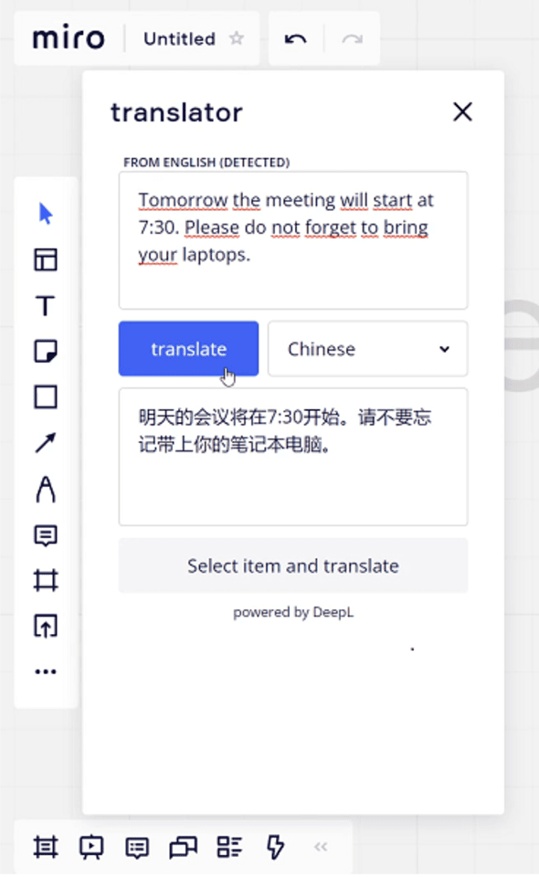

# Junction 2021 - Miro plugins

This is [the winning project of Miro's Junction 2021 challenge](https://app.hackjunction.com/projects/junction-2021/view/61981a1db8591f00a6b8afc6), Collaborate Without Constraint.

We tackled the challenge with a couple of plugins. An integration with [DeepL's translation API](https://www.deepl.com/pro-api?cta=header-pro-api) allows users in multicultural teams to express themselves with confidence. Another integration with the [RANDOM.ORG service](https://www.random.org/) can speed up decision processes and bring some fun to the team.

Find how to build each plugin on its own readme.

## Screenshots

&nbsp;&nbsp;&nbsp;&nbsp;&nbsp;

